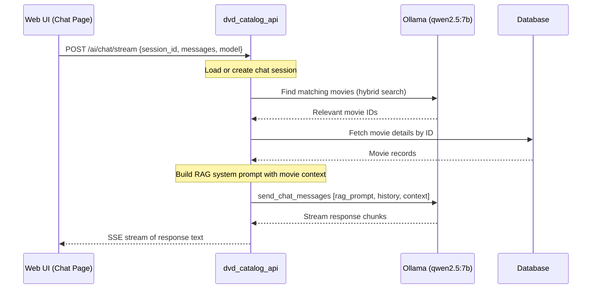
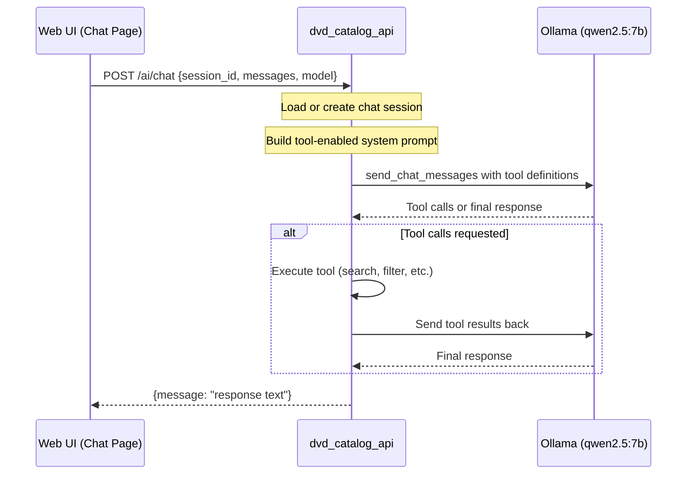
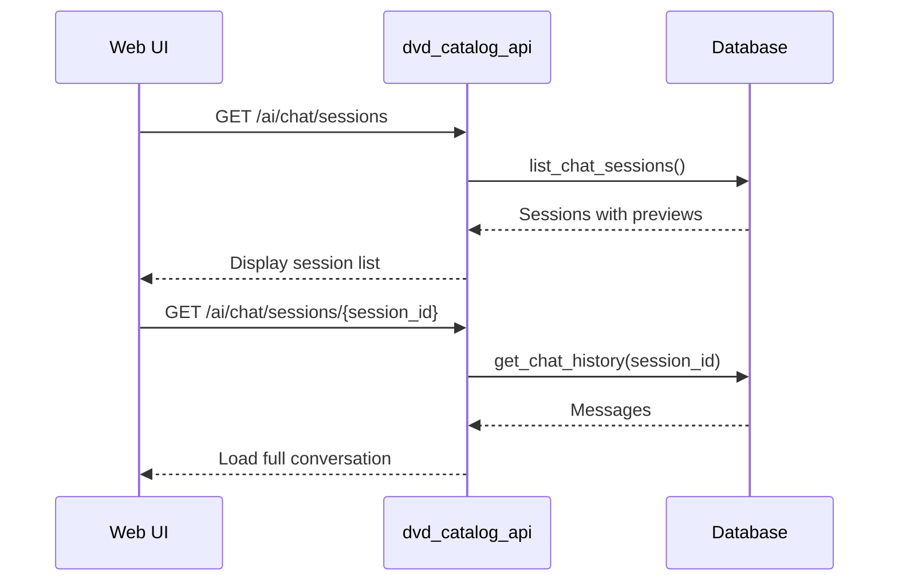
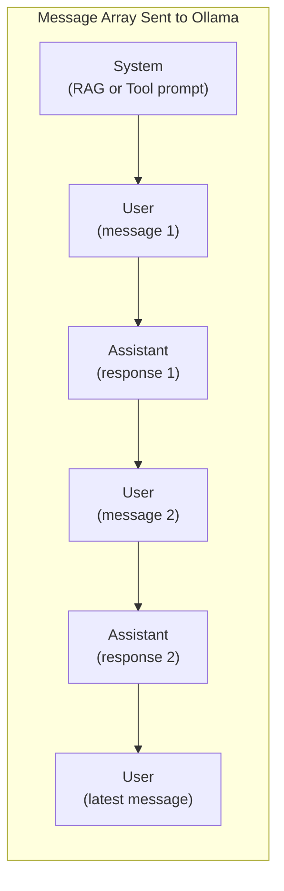

# AI Chat Flow

How conversational AI chat requests are processed. The chat assistant is designed to answer questions about your movie collection. It supports two modes: **RAG** (streaming, retrieval-augmented generation) and **Tool** (non-streaming, tool-calling). Chat sessions are persisted in the database.

> Chat is still very experimental.

## Chat Modes

### RAG Mode — `/ai/chat/stream`

The API first finds relevant movies from the collection, then streams the LLM response that includes those movies as context.

### Tool Mode — `/ai/chat`

The LLM is given a set of tools it can call to query the API (e.g., search by actor, genre, director). It returns a single non-streaming response.

## Session Persistence

Chat sessions are stored in the database. Each session has a UUID, creation time, and last-updated time. Messages are saved as the conversation progresses.

## System Prompts

The prompts are defined in the `prompts` crate. Users can edit them in the web UI and reset to defaults.

- **RAG prompt** — instructs the assistant to answer based on the retrieved movie context.
- **Tool prompt** — instructs the assistant to use the available tools to query the collection.

## Message Flow

## Error Handling

| Condition | Response |
|-----------|----------|
| Ollama unreachable | `500 Internal Server Error` — Error message from Ollama |
| Model not installed | `500 Internal Server Error` — Ollama model error |
| Invalid session ID | `400 Bad Request` |

## Notes

- Two modes are available: **RAG** (streaming with retrieval) and **Tool** (non-streaming with tool-calling).
- Chat sessions are persisted server-side; users can resume past conversations from the history panel.
- The assistant answers questions about the movie collection, not general topics.
- Default chat model: `qwen2.5:7b` (configurable per request).
