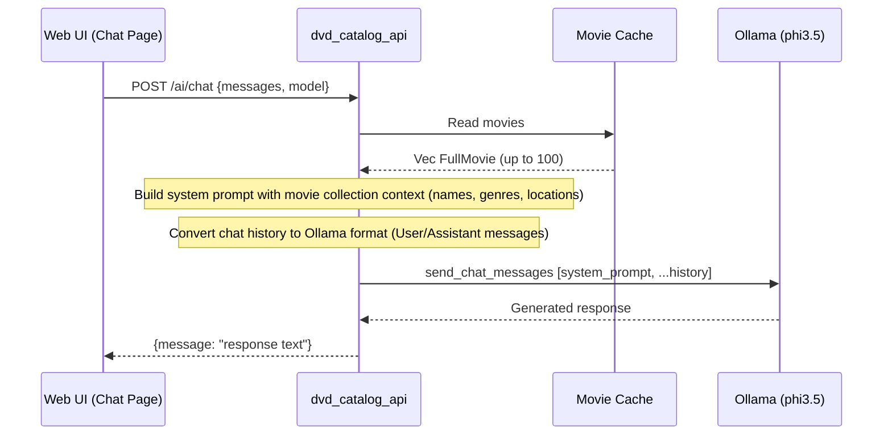
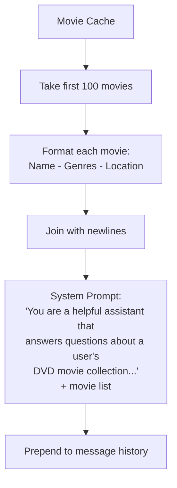
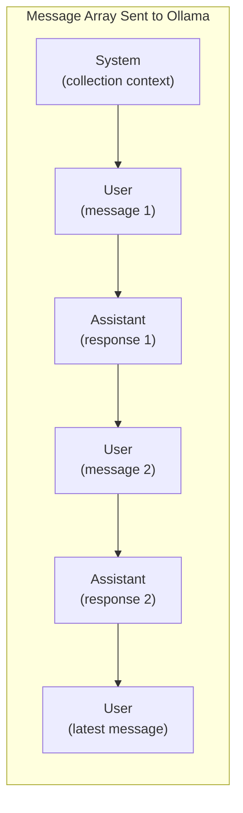

# AI Chat Flow

How conversational AI chat requests are processed. The chat endpoint is a general-purpose assistant that also has access to the user's DVD collection as context. It builds movie context from the cache, constructs a message history with a system prompt, and sends the conversation through Ollama.

## Chat Sequence

## System Prompt Construction

The API dynamically builds the system prompt by injecting up to 100 movies from the cache:

## Message Flow

## Error Handling

| Condition | Response |
|-----------|----------|
| Empty movie cache | Chat still works — system prompt notes the collection is empty |
| Ollama unreachable | `500 Internal Server Error` — Error message from Ollama |
| Model not installed | `500 Internal Server Error` — Ollama model error |

## Notes

- Chat history is maintained **client-side** in the Dioxus frontend (via `use_signal`)
- The full message history is sent with each request (no server-side session)
- The system prompt includes movie names, genres, and physical locations so the AI can recommend where to find a DVD
- Default model: `phi3.5` (configurable per request)
