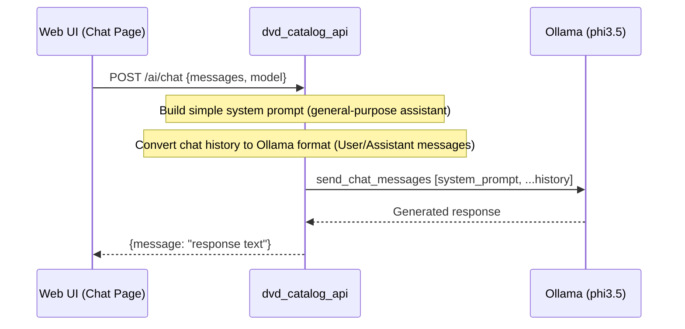
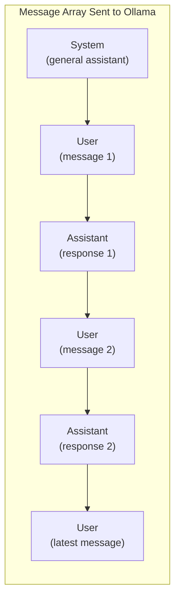

# AI Chat Flow

How conversational AI chat requests are processed. The chat endpoint is a pure general-purpose assistant that can discuss any topic. No DVD collection context is provided.

## Chat Sequence



## System Prompt

The API uses a simple general-purpose system prompt:

```
"You are a friendly and knowledgeable assistant. 
You can help with any topic the user asks about. 
Be conversational, helpful, and concise."
```

This is prepended to the message history before sending to Ollama.

## Message Flow



## Error Handling

| Condition | Response |
|-----------|----------|
| No special conditions | Chat works independently of the movie cache |
| Ollama unreachable | `500 Internal Server Error` — Error message from Ollama |
| Model not installed | `500 Internal Server Error` — Ollama model error |

## Notes

- Chat history is maintained **client-side** in the Dioxus frontend (via `use_signal`)
- The full message history is sent with each request (no server-side session)
- The system prompt is a simple general-purpose assistant directive with no collection context
- The AI can discuss any topic without restrictions
- Default model: `phi3.5` (configurable per request)
