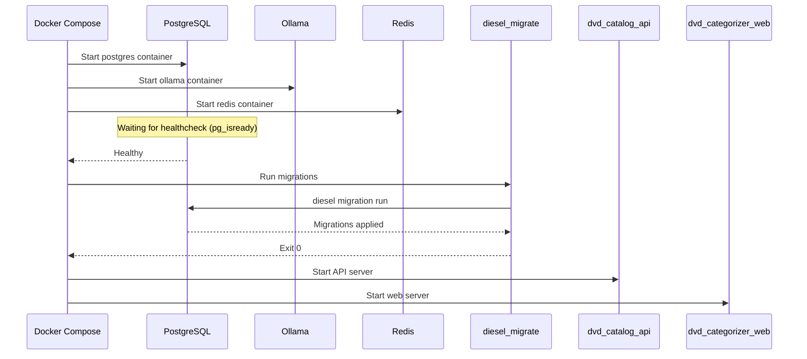
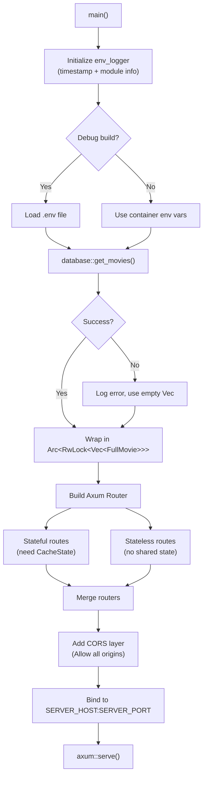
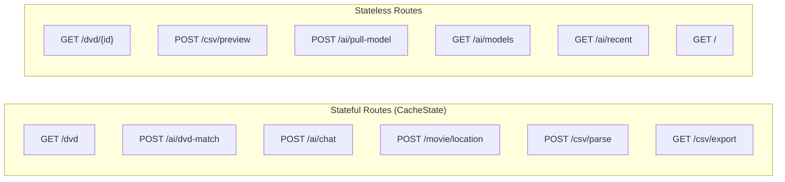
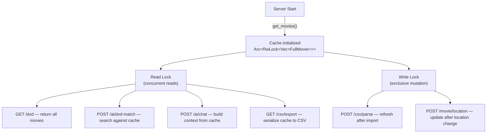

# Application Startup Flow

How the application boots up across Docker Compose services and initializes internal state.

## Docker Compose Service Startup

## API Server Initialization

## Router Structure

## Cache Lifecycle

## Environment Variables

| Variable | Default | Used By |
|----------|---------|---------|
| `server_host` | `0.0.0.0` | API bind address |
| `server_port` | `3000` | API bind port |
| `DATABASE_URL` | — | Diesel database connection |
| `OLLAMA_HOST` | `ollama` | AI service hostname |
| `OLLAMA_PORT` | `11434` | AI service port |
| `RUST_LOG` | `info` | Log level filter |
