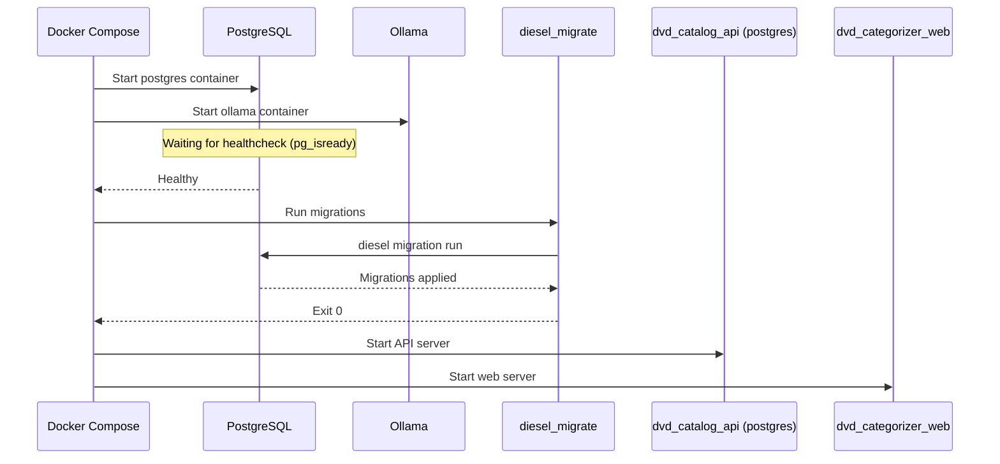
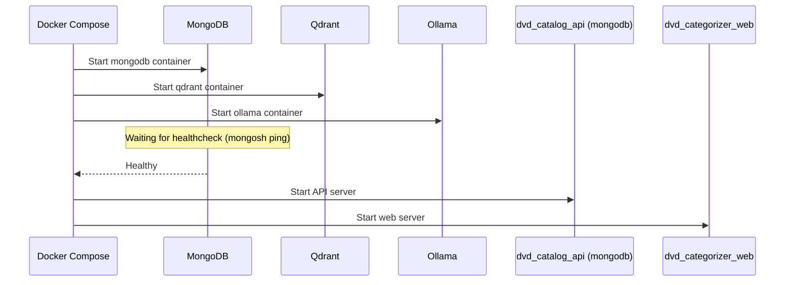
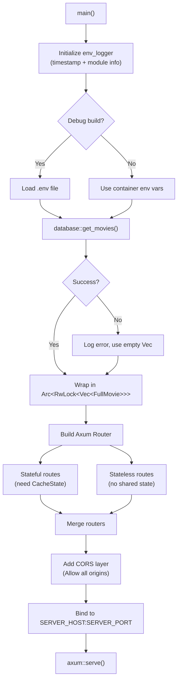
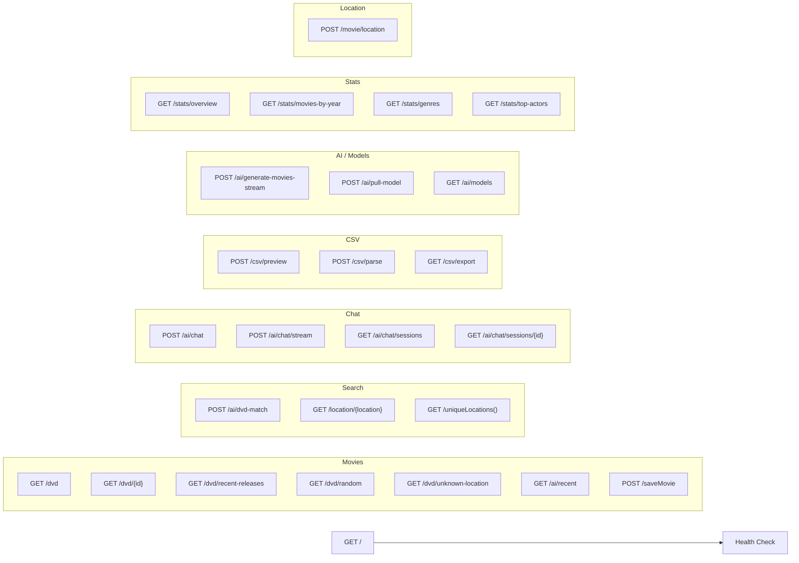
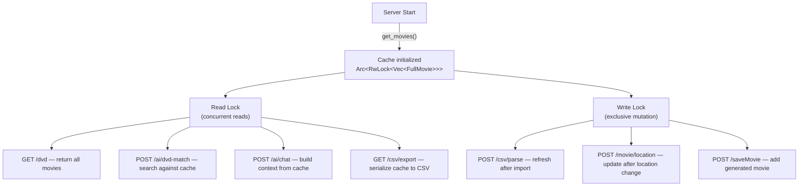

# Application Startup Flow

How the application boots up across Docker Compose services and initializes internal state.

## Docker Compose Service Startup

The application uses Docker Compose profiles to select a backend. You must pass either `--profile postgres` or `--profile mongodb` when starting services. Shared services (`ollama`, `qdrant`, `grafana`, `prometheus`, etc.) have no profile and start with either selection.

### PostgreSQL Profile

### MongoDB Profile

## API Server Initialization

## Router Structure

All routes receive the database state (`DbState`) and are grouped by feature below.

## Cache Lifecycle

## Environment Variables

| Variable | Default | Used By | Backend |
|----------|---------|---------|---------|
| `server_host` | `0.0.0.0` | API bind address | Both |
| `server_port` | `3000` | API bind port | Both |
| `DATABASE_URL` | — | PostgreSQL connection | PostgreSQL |
| `MONGODB_URI` | — | MongoDB connection | MongoDB |
| `QDRANT_URL` | — | Qdrant gRPC URL | MongoDB |
| `QDRANT_COLLECTION` | `movies` | Qdrant collection name | MongoDB |
| `OLLAMA_HOST` | `ollama` | AI service hostname | Both |
| `OLLAMA_PORT` | `11434` | AI service port | Both |
| `RUST_LOG` | `info` | Log level filter | Both |
