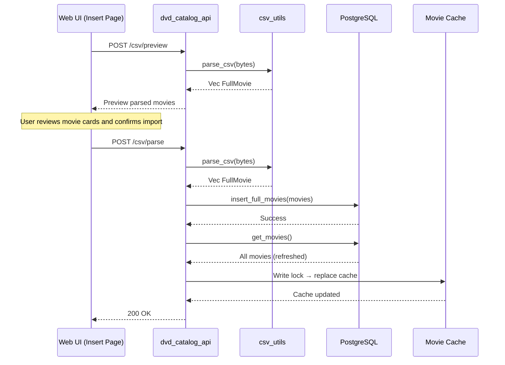
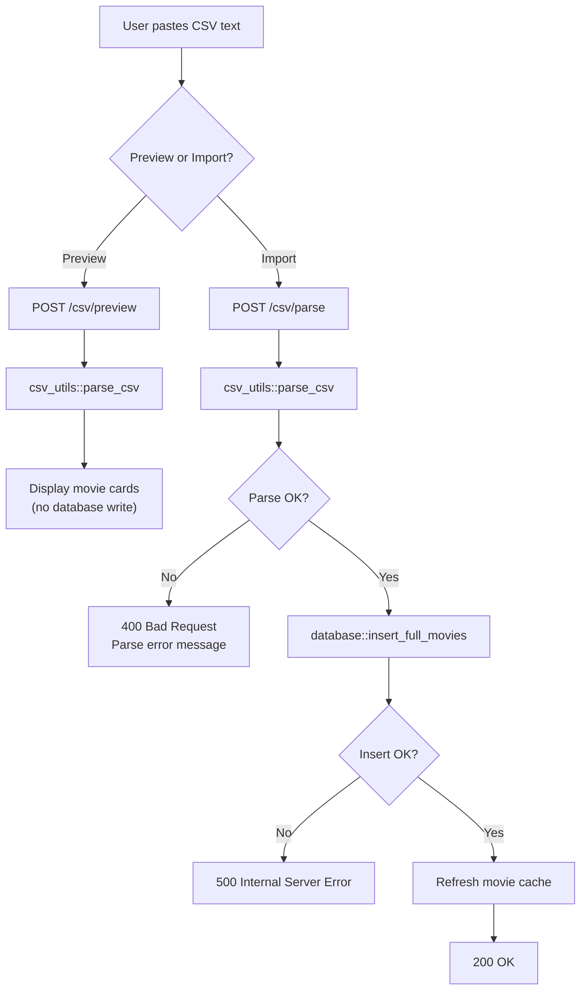
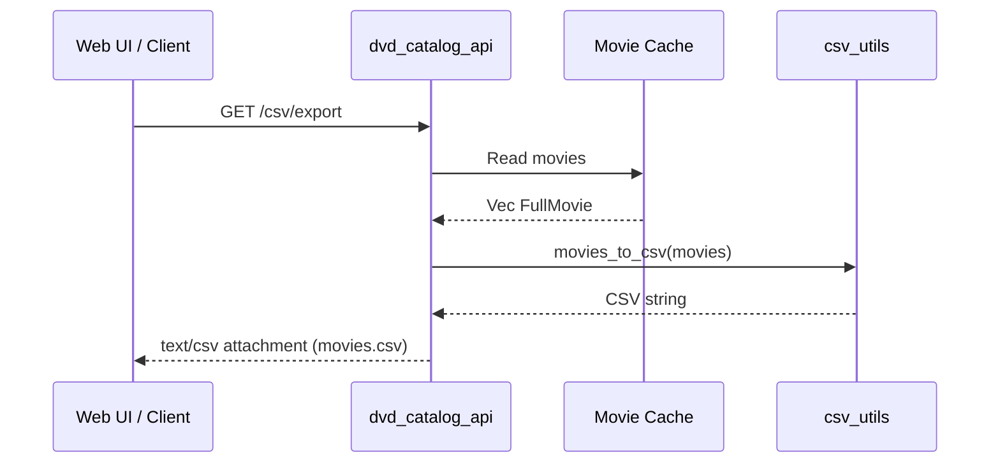

# CSV Import/Export Flow

How movie data is imported via the web UI and exported from the API.

## Import Flow (Web UI → API → Database)



## Import Decision Flow



## Export Flow



## CSV Format

Header row is **required**. Column order does not matter.

```
Title,Year,Description,Actors,Genres,Director,AddedOn,Location
```

| Column | Required | Notes |
|--------|----------|-------|
| Title | Yes | Movie name (max 100 chars) |
| Year | Yes | Release year (integer, use 0 for unknown) |
| Description | No | Free text, used for embedding generation |
| Actors | No | Comma-separated within the field |
| Genres | No | Comma-separated within the field |
| Director | No | Single director name |
| AddedOn | No | Timestamp |
| Location | Yes | Physical location (max 100 chars) |
