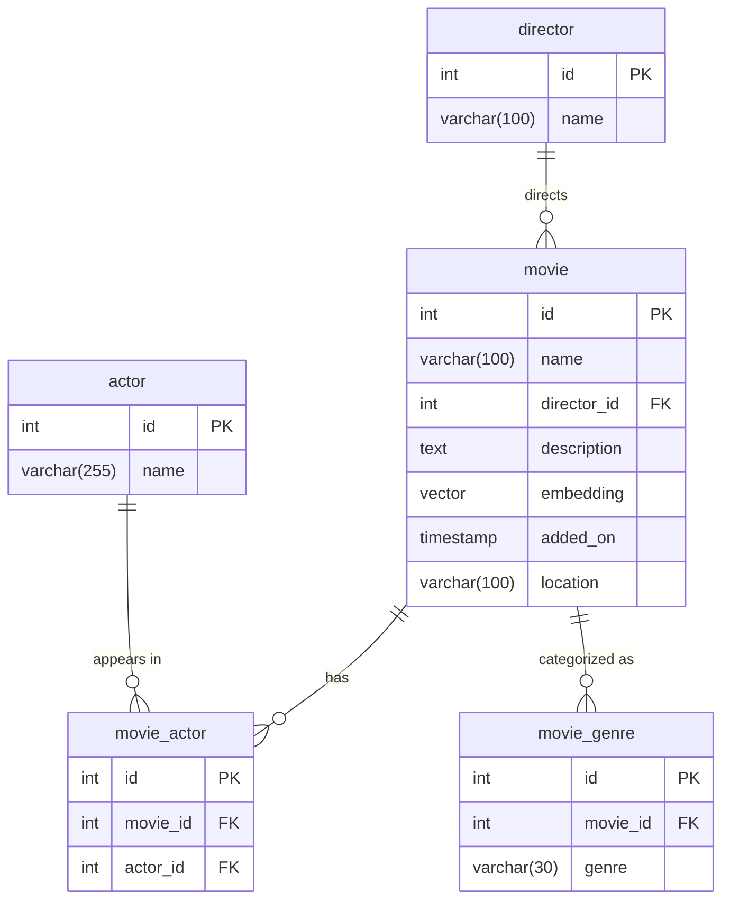

# Entity Relationship Diagram

Database schema for the DVD Categorize application. Generated from `models/src/schema.rs`.

## Notes

- **movie.embedding** — pgvector `Vector` type storing AI-generated embeddings from `nomic-embed-text` for semantic similarity search
- **movie.director_id** — Nullable; not all movies have a director assigned
- **movie.description** — Nullable; used as the source text for embedding generation
- **movie_actor** — Many-to-many join table between movies and actors
- **movie_genre** — One-to-many; genres are stored as strings per movie (not a separate genre table)
- All joins defined via Diesel's `joinable!` macro in `schema.rs`
