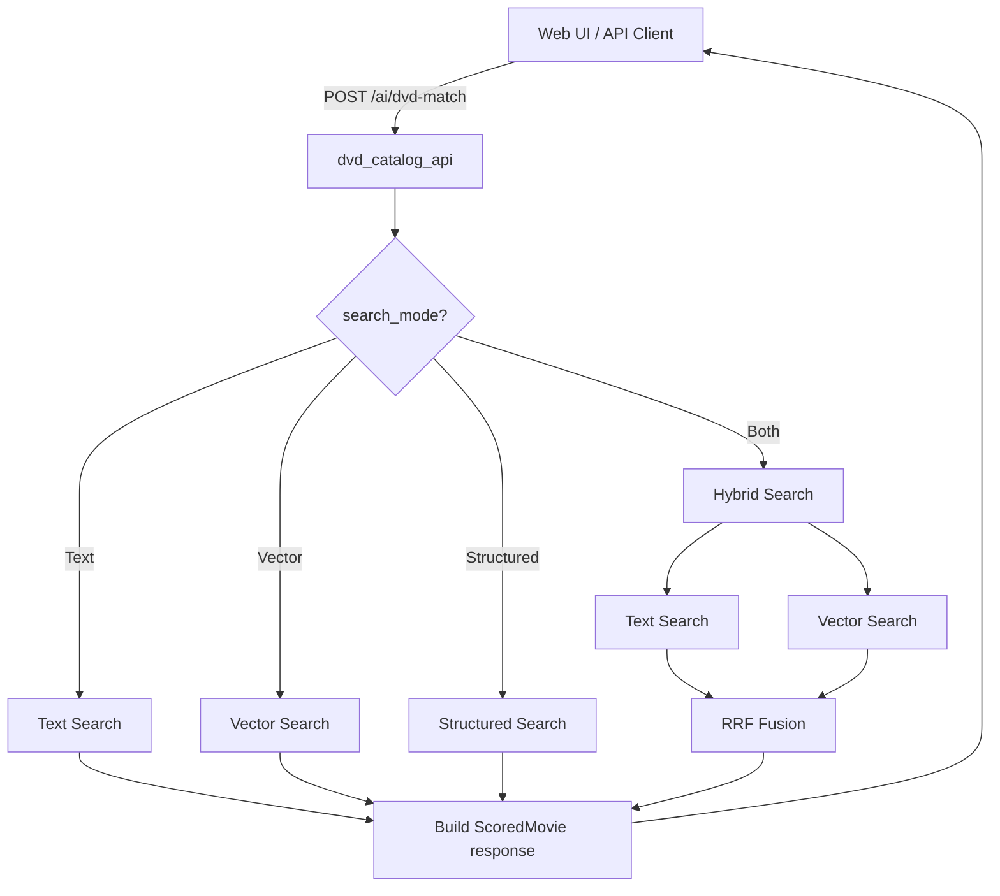
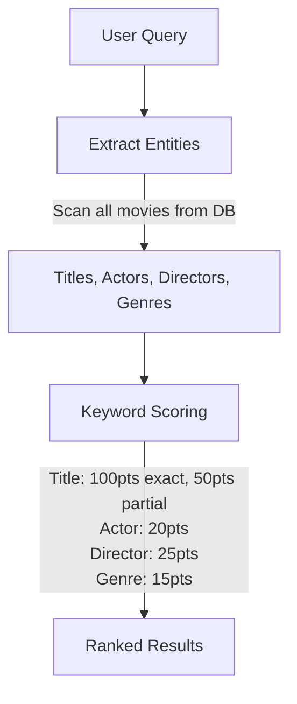
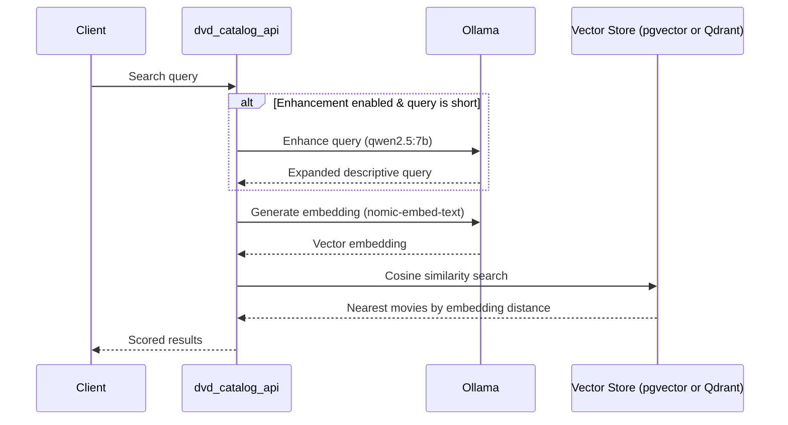
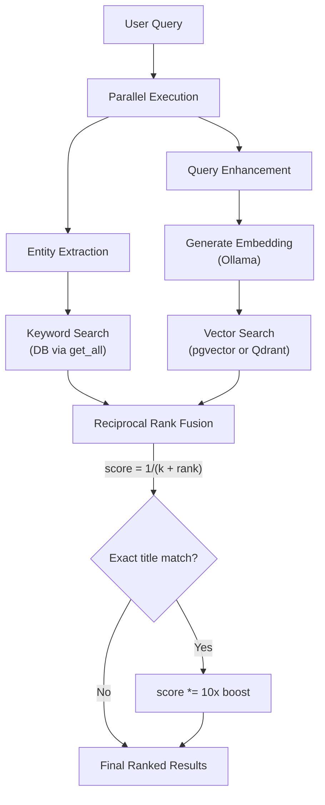
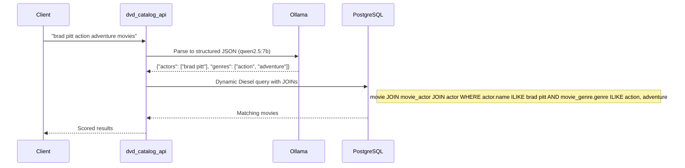

# Search Flow

How movie search requests are processed through the application. The API dispatches to one of four search strategies based on the `search_mode` field in the request.

## Dispatch Flow



## Text Search

Pure keyword matching against all movies in the database. No AI involvement.



## Vector Search

Semantic search using AI embeddings. Short queries are enhanced first. The actual vector store depends on the active backend:

- **PostgreSQL** — `pgvector` column with cosine distance.
- **MongoDB** — Qdrant vector database with cosine similarity.



## Hybrid Search (Both)

Runs Text and Vector in parallel, then fuses with Reciprocal Rank Fusion.



### RRF Formula

```
RRF_score(movie) = Σ 1 / (k + rank_i)
```

- **k = 60** (standard constant)
- Exact title matches (keyword score >= 100) receive a **10x boost multiplier**
- Results from both lists are merged by movie ID, scores summed

## Structured Search

AI parses natural language into structured JSON criteria, then Diesel builds type-safe queries.



### Structured Query Fields

| Field | Maps To | Join Required |
|-------|---------|---------------|
| `actors` | `actor.name` | `movie_actor` + `actor` |
| `directors` | `director.name` | `director` |
| `genres` | `movie_genre.genre` | `movie_genre` |
| `title_keywords` | `movie.name` | None |
| `description_keywords` | `movie.description` | None |

All filters use **ILIKE** (case-insensitive) and combine with **AND** logic.

See [STRUCTURED_SEARCH.md](../Explantion/STRUCTURED_SEARCH.md) for additional details.
