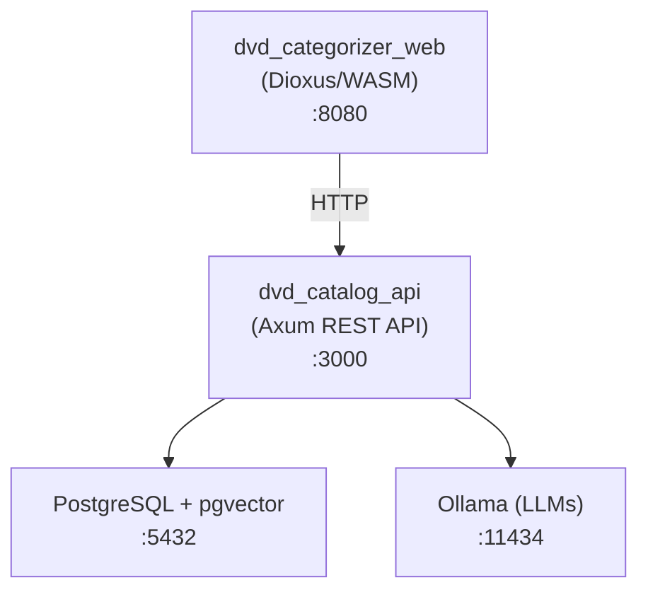

# DVD Categorize

A full-stack Rust application for cataloging, searching, and exploring a personal DVD/movie collection. Features AI-powered search with multiple search modes, a conversational AI chat assistant, vector embeddings for semantic search, and a modern dark-themed web UI — all fully containerized with Docker Compose.

## Features

- **Multi-Mode Search** — Four distinct search strategies:
  - **Text** — Keyword-based entity extraction matching against titles, actors, directors, and genres
  - **Vector** — Semantic search using AI-generated vector embeddings (pgvector + `nomic-embed-text`)
  - **Hybrid (Both)** — Combines text and vector results via Reciprocal Rank Fusion (RRF)
  - **Structured** — AI parses natural language into structured criteria, then builds type-safe Diesel queries
- **AI Chat** — Conversational assistant that answers questions about your movie collection using Ollama LLMs
- **Query Enhancement** — Short queries are automatically expanded by AI for better semantic search results
- **CSV Import/Export** — Import movies from CSV via the web UI, export your collection back to CSV
- **Movie Management** — Add movies, update locations, view recent additions
- **Model Management** — Pull and list Ollama models directly from the web UI
- **Dark-Themed UI** — Modern Dioxus/WASM frontend with teal accent styling and responsive movie card grid
- **Vector Embeddings** — Movie descriptions are embedded at import time for semantic similarity search
- **In-Memory Cache** — Movies are cached in an `Arc<RwLock<>>` on the API server for fast reads

## Architecture



### Workspace Crates

| Crate | Description |
|-------|-------------|
| `dvd_catalog_api` | Axum HTTP API server — routes, search orchestration, caching |
| `dvd_categorizer_web` | Dioxus frontend UI compiled to WASM |
| `ai_chat` | Ollama integration — chat, embeddings, query enhancement, structured query parsing |
| `database` | Diesel async PostgreSQL layer — CRUD, vector search, structured search |
| `models` | Shared domain types, Diesel schema, feature-gated traits (postgres, ai, vector-similarity, text-matching) |
| `csv_utils` | CSV parsing and serialization for movie data |
| `csv_reader` | *(deprecated)* CLI binary for bulk-loading CSV into the database — replaced by the Insert page |
| `categorizer_utilities` | Miscellaneous utility functions |

### Services (Docker Compose)

| Service | Image / Build | Purpose |
|---------|--------------|---------|
| `postgres` | `pgvector/pgvector:pg17` | PostgreSQL 17 with pgvector extension for vector similarity search |
| `ollama` | `ollama/ollama:rocm` | Local LLM inference (ROCm/AMD GPU accelerated) |
| `redis` | `redis:alpine` | Caching layer | NOTE: Redis is not used currently, but will be used for caching user chat history.
| `diesel_migrate` | Custom (Diesel CLI) | Runs database migrations on startup |
| `dvd_categorize_api` | Custom (Rust/Axum) | REST API server |
| `dvd_categorize_web` | Custom (Dioxus/WASM) | Frontend web server |

Migrations are managed by Diesel CLI and run automatically on container startup.

## Prerequisites

- **Docker** and **Docker Compose**
- **AMD GPU** (ROCm) for GPU-accelerated Ollama inference, or modify the `ollama` service in docker-compose to use `ollama/ollama` (CPU) or `ollama/ollama:cuda` (NVIDIA). I am not sure about Apple M* processors. I'd check the Ollama docs for Mac support.

## Setup

### 1. Create the Ollama data volume

This is done manually so `docker compose down -v` does not delete the large model files:

```bash
docker volume create ollama_data
```

### 2. Environment configuration

Copy `default.env` to `.env` and adjust values as needed:

```bash
cp default.env .env
```

Key variables:
- `POSTGRES_PASSWORD` — Database password
- `UID` / `GID` / `USERNAME` — Used for file permission mapping in dev containers. This is because by default dev containers write build assets to the local target directory. Depending on user permissions on the host system you may end up not able to read/write the file created by the container. This ensures you remain able to read/write the file.
- `SERVER_HOST` / `SERVER_PORT` — API server bind address (default `0.0.0.0:3000`)

### 3. Pull required Ollama models

Models can be browsed at https://ollama.com/search. The application uses these by default:

| Model | Purpose |
|-------|---------|
| `phi3.5` | Chat, query enhancement, and structured query parsing |
| `nomic-embed-text` | Vector embedding generation |

You can pull models either from the **Models** page in the web UI once the app is running, or via the Ollama container directly:

```bash
docker compose exec ollama ollama pull phi3.5
docker compose exec ollama ollama pull nomic-embed-text
```

## Running

### Production

Builds are compiled with `--release` and may take a while on first build:

```bash
docker compose -f docker-compose-prod.yml up
```

### Local Development

Development containers bind-mount the local source directory so you can iterate without rebuilding images:

```bash
docker compose up
```

### Accessing the Application

| Service | URL |
|---------|-----|
| **Web UI** | http://localhost:8080 |
| **API** | http://localhost:3000 |
| **Ollama** | http://localhost:11434 |

## Web UI Pages

- **Home** — Landing page with navigation
- **List** — Browse all movies in the collection
- **Live** — AI-powered search with mode selector (Text / Vector / Both / Structured), query enhancement toggle, and model selection
- **Chat** — Conversational AI assistant for asking questions about your movie collection
- **Insert** — Paste CSV data to preview and import movies directly from the browser
- **Models** — View installed Ollama models and pull new ones

## API Endpoints

| Method | Path | Description |
|--------|------|-------------|
| `GET` | `/` | Health check |
| `GET` | `/dvd` | Get all movies (cached) |
| `GET` | `/dvd/{id}` | Get a single movie by ID |
| `POST` | `/ai/dvd-match` | Search movies (supports all four search modes) |
| `POST` | `/ai/chat` | Conversational AI chat about the collection |
| `GET` | `/ai/recent` | Get recently added movies |
| `GET` | `/ai/models` | List available Ollama models |
| `POST` | `/ai/pull-model` | Pull a new Ollama model |
| `POST` | `/movie/location` | Update a movie's physical location |
| `POST` | `/csv/parse` | Import movies from CSV data |
| `POST` | `/csv/preview` | Preview parsed CSV without saving |
| `GET` | `/csv/export` | Export all movies as a CSV download |

## Search Modes

### Text
Pure keyword matching with entity extraction. Parses the query to identify titles, actors, directors, and genres from the existing collection, then scores movies by match quality. Best for exact name lookups.

### Vector
Generates a vector embedding of the query using `nomic-embed-text`, then finds the closest movies by cosine similarity in pgvector. Short queries are enhanced by AI first. Best for thematic or conceptual searches (e.g., "movies about redemption").

### Both (Hybrid)
Runs Text and Vector searches in parallel, then fuses results using Reciprocal Rank Fusion (RRF). Exact title matches receive a score boost to ensure they rank first. Best general-purpose mode.

### Structured
AI parses the natural language query into structured JSON (actors, directors, genres, title keywords, description keywords), then builds type-safe Diesel queries with proper table joins. No SQL is ever generated by the AI. Best for specific multi-criteria searches (e.g., "brad pitt action adventure movies").

See [STRUCTURED_SEARCH.md](Documentation/Explantion/STRUCTURED_SEARCH.md) for detailed documentation on the structured search mode.

## Documentation

Detailed diagrams and explanations for core application flows:

- **[ER Diagram](Documentation/Diagrams/ER_DIAGRAM.md)** — Database schema and table relationships
- **[Search Flow](Documentation/Diagrams/SEARCH_FLOW.md)** — All four search modes with flow and sequence diagrams
- **[AI Chat Flow](Documentation/Diagrams/AI_CHAT_FLOW.md)** — Chat message lifecycle and system prompt construction
- **[CSV Import/Export Flow](Documentation/Diagrams/CSV_IMPORT_FLOW.md)** — Import preview, import, and export sequences
- **[Application Startup](Documentation/Diagrams/APPLICATION_STARTUP.md)** — Docker Compose boot order, API initialization, cache lifecycle
- **[Structured Search](Documentation/Explantion/STRUCTURED_SEARCH.md)** — Deep dive on AI-parsed structured queries

## Tech Stack

- **Language** — Rust (2021 edition, workspace with 8 crates)
- **Backend** — Axum, Tokio, Diesel (async), Tower
- **Frontend** — Dioxus 0.7 (compiled to WASM), TailwindCSS
- **Database** — PostgreSQL 17 + pgvector
- **AI/LLM** — Ollama (via ollama-rs), ROCm GPU acceleration
- **Embeddings** — nomic-embed-text model
- **Containerization** — Docker Compose with multi-stage builds
- **Caching** — Redis, in-memory Arc<RwLock<>> for movie data
