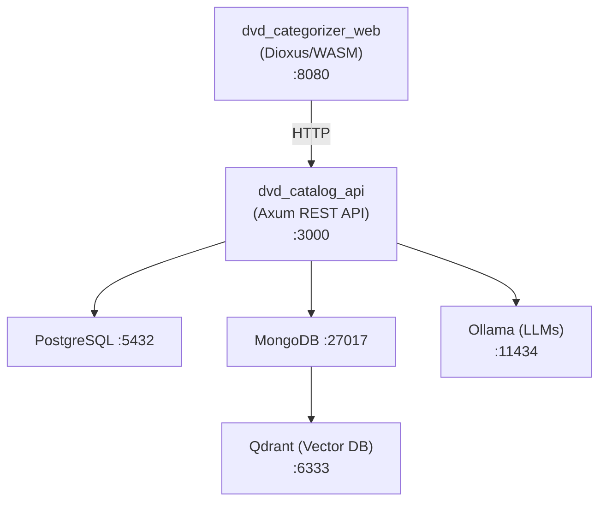

# DVD Categorize

DVD Categorize is a full-stack web application for cataloging, searching, and exploring your personal DVD or movie collection. It combines traditional database search with local AI models to help you find movies, ask questions about your collection, and even generate new movie records from a list of titles.

Everything runs in Docker Compose: a dark-themed web UI, a Rust/Axum API, a vector database for semantic search, and local LLM inference via Ollama.

## What You Can Do

- **Find movies** using four search modes, from exact keyword matching to AI-powered natural language search.
- **Browse** recently added, recent releases, random picks, or movies without a known location.
- **Ask questions** about your collection with a conversational AI assistant.
- **Generate movie records** from titles using AI, then review, edit, and save them.
- **Import and export** your catalog via CSV.
- **Track physical locations** and see collection statistics.
- **Pull new AI models** directly from the web UI.

## Features

- **Multi-Mode Search** — Four distinct search strategies:
  - **Text** — Keyword-based entity extraction matching against titles, actors, directors, and genres
  - **Vector** — Semantic search using AI-generated vector embeddings (`pgvector` for PostgreSQL, Qdrant for MongoDB)
  - **Hybrid (Both)** — Combines text and vector results via Reciprocal Rank Fusion (RRF)
  - **Structured** — AI parses natural language into structured criteria, then builds database-specific queries (Diesel for PostgreSQL, MongoDB query operators for MongoDB)
- **AI Chat** — Conversational assistant that answers questions about your movie collection using Ollama LLMs
- **Movie Generator** — Generate movie records from titles, review and edit the results, lock cards you want to keep, and save them to the catalog
- **Query Enhancement** — Short queries are automatically expanded by AI for better semantic search results
- **CSV Import/Export** — Import movies from CSV via the web UI, export your collection back to CSV
- **Movie Management** — Add movies, update locations, view recent additions
- **Model Management** — Pull and list Ollama models directly from the web UI
- **Dark-Themed UI** — Modern Dioxus/WASM frontend with teal accent styling and responsive movie card grid
- **Vector Embeddings** — Movie descriptions are embedded at import time for semantic similarity search
- **In-Memory Cache** — Movies are cached in an `Arc<RwLock<>>` on the API server for fast reads

## Web UI Tour

### Live — `/live`

The main page for finding movies. Use the browse toolbar to quickly view recently added, recently released, random, or unknown-location movies, or to filter by a physical location. Type a query and choose one of four search modes:

- **Text** — keyword matching for exact names
- **Vector** — semantic search using AI embeddings
- **Hybrid** — combines text and vector results
- **Structured** — AI parses natural language into safe database filters

You can also pick an AI model and toggle AI query enhancement.

### Generator — `/generator`

Enter one or more movie titles (use `|` to add multiple at once) and click **Generate**. The AI streams movie cards one by one, filling in title, year, description, cast, director, and genres. Lock cards you want to keep, then re-generate the rest. Save or edit cards before adding them to the catalog. Duplicate titles are detected automatically.

### Insert — `/movies/new`

Paste CSV data to preview and import movies. The required header is `Title,Year,Description,Actors,Genres,Director,AddedOn,Location`. You can also export the entire catalog as CSV.

### Chat — `/ai/chat`

> Chat is still very experimental.

Ask natural-language questions about your collection. Choose between streaming **RAG** mode (matches are injected into the prompt) and non-streaming **Tool** mode (the LLM uses tools to query the API). Edit system prompts, switch models, and resume previous sessions from the history panel.

### Stats — `/stats`

View collection statistics: total movies, directors, and actors, plus bar/pie charts for years, genres, and top actors.

### Models — `/ai/models`

Pull new Ollama models directly from the web UI. The available models are shared across search, chat, and generator model selectors.

## Architecture



Qdrant is used only when the MongoDB backend is enabled. The PostgreSQL backend relies on text and structured search.

### Workspace Crates

| Crate | Description |
|-------|-------------|
| `dvd_catalog_api` | Axum HTTP API server — routes, search orchestration, caching |
| `dvd_categorizer_web` | Dioxus frontend UI compiled to WASM |
| `ai_chat` | Ollama integration — chat, embeddings, query enhancement, structured query parsing |
| `database` | Database abstraction layer with PostgreSQL (Diesel async) and MongoDB support — CRUD, vector search (via Qdrant), structured search |
| `models` | Shared domain types, Diesel schema (PostgreSQL), feature-gated traits (postgres, mongodb, ai, vector-similarity, text-matching) |
| `csv_utils` | CSV parsing and serialization for movie data |
| `csv_reader` | *(deprecated)* CLI binary for bulk-loading CSV into the database — replaced by the Insert page |
| `categorizer_utilities` | Miscellaneous utility functions |

### Services (Docker Compose)

| Service | Image / Build | Purpose |
|---------|--------------|---------|
| `postgres` | `pgvector/pgvector:pg17` | PostgreSQL 17 with pgvector extension (when using PostgreSQL backend) |
| `mongodb` | `mongo:latest` | MongoDB (when using MongoDB backend) |
| `qdrant` | `qdrant/qdrant:latest` | Vector database for semantic search embeddings |
| `ollama` | `ollama/ollama:rocm` | Local LLM inference (ROCm/AMD GPU accelerated) |
| `diesel_migrate` | Custom (Diesel CLI) | Runs database migrations on startup (PostgreSQL only) |
| `dvd_categorize_api` | Custom (Rust/Axum) | REST API server |
| `dvd_categorize_web` | Custom (Dioxus/WASM) | Frontend web server |
| `loki` | `grafana/loki:latest` | Log aggregation and storage |
| `promtail` | `grafana/promtail:latest` | Docker log collector for Loki |
| `grafana` | `grafana/grafana:latest` | Metrics dashboards and log viewer |
| `prometheus` | `prom/prometheus:latest` | Metrics storage (cAdvisor, node-exporter) |
| `cadvisor` | `gcr.io/cadvisor/cadvisor:latest` | Container resource metrics |
| `node-exporter` | `prom/node-exporter:latest` | Host system metrics |

Migrations are managed by Diesel CLI and run automatically on container startup.

## Prerequisites

- **Docker** and **Docker Compose**
- **AMD GPU** (ROCm) for GPU-accelerated Ollama inference, or modify the `ollama` service in docker-compose to use `ollama/ollama` (CPU) or `ollama/ollama:cuda` (NVIDIA). I am not sure about Apple M* processors. I'd check the Ollama docs for Mac support.

## Setup

### 1. Create the Ollama data volume

This is done manually so `docker compose down -v` does not delete the large model files:

```bash
docker volume create ollama_data
```

### 2. Environment configuration

Copy `default.env` to `.env` and adjust values as needed:

```bash
cp default.env .env
```

Key variables:
- `POSTGRES_PASSWORD` — Database password
- `UID` / `GID` / `USERNAME` — Used for file permission mapping in dev containers. This is because by default dev containers write build assets to the local target directory. Depending on user permissions on the host system you may end up not able to read/write the file created by the container. This ensures you remain able to read/write the file.
- `SERVER_HOST` / `SERVER_PORT` — API server bind address (default `0.0.0.0:3000`)

### 3. Pull required Ollama models

Models can be browsed at https://ollama.com/search. The application uses these by default:

| Model | Purpose |
|-------|---------|
| `qwen2.5:7b` | Chat, query enhancement, and structured query parsing |
| `nomic-embed-text` | Vector embedding generation |

You can pull models either from the **Models** page in the web UI once the app is running, or via the Ollama container directly:

```bash
docker compose exec ollama ollama pull qwen2.5:7b
docker compose exec ollama ollama pull nomic-embed-text
```

## Running

### Production

Builds are compiled with `--release` and may take a while on first build. You must select a backend profile, either `postgres` or `mongodb`:

```bash
docker compose -f docker-compose-prod.yml --profile postgres up
# or
docker compose -f docker-compose-prod.yml --profile mongodb up
```

### Local Development

Development containers bind-mount the local source directory so you can iterate without rebuilding images. Select a backend profile:

```bash
docker compose --profile postgres up
# or
docker compose --profile mongodb up
```

### Accessing the Application

| Service | URL |
|---------|-----|
| **Web UI** | http://localhost:8080 |
| **API** | http://localhost:3000 |
| **Ollama** | http://localhost:11434 |
| **Qdrant Dashboard** | http://localhost:6333/dashboard |
| **Mongo Express** | http://localhost:8082 (MongoDB backend only) |

### Monitoring & Observability

| Service | URL | Description |
|---------|-----|-------------|
| **Grafana** | http://localhost:3001 | Metrics dashboards and log exploration (auto-provisioned with default dashboard) |
| **Prometheus** | http://localhost:9090 | Metrics storage and querying (PromQL) |
| **cAdvisor** | http://localhost:8081 | Real-time container resource usage and performance |
| **Node Exporter** | http://localhost:9100/metrics | Host system metrics (CPU, memory, disk, network) |

**Pre-configured Dashboard:** The `DVD Categorize Overview` dashboard is automatically loaded in Grafana and includes:
- Container CPU, Memory, and Network I/O graphs
- Host system resource stats
- Live API logs from Loki

**Log Queries in Grafana:** Navigate to **Explore** → **Loki** and use queries like:
```logql
{service="dvd_categorize_api"} |= "{"
```

## Web UI Pages

- **Live** — `/live` — AI-powered search and browse interface
- **Generator** — `/generator` — AI-assisted movie record generation
- **Insert** — `/movies/new` — CSV import and export
- **Chat** — `/ai/chat` — Conversational AI assistant
- **Stats** — `/stats` — Collection statistics and charts
- **Models** — `/ai/models` — Ollama model management

The Chat, Generator, and Models pages require the application to be built with AI backend support.

## API Endpoints

| Method | Path | Description |
|--------|------|-------------|
| `GET` | `/` | Health check |
| `GET` | `/dvd` | Get all movies (cached) |
| `GET` | `/dvd/{id}` | Get a single movie by ID |
| `POST` | `/ai/dvd-match` | Search movies (supports all four search modes) |
| `POST` | `/ai/chat` | Conversational AI chat about the collection |
| `POST` | `/ai/chat/stream` | Streaming AI chat with RAG |
| `GET` | `/ai/chat/sessions` | List saved chat sessions |
| `GET` | `/ai/recent` | Get recently added movies |
| `GET` | `/dvd/random` | Get random movies |
| `GET` | `/dvd/recent-releases` | Get movies from a recent release window |
| `GET` | `/dvd/unknown-location` | Get movies with no location set |
| `GET` | `/location/{location}` | Get movies at a specific location |
| `POST` | `/ai/generate-movies-stream` | Stream AI-generated movie cards from a list of titles |
| `POST` | `/saveMovie` | Save a generated movie card to the catalog |
| `GET` | `/ai/models` | List available Ollama models |
| `POST` | `/ai/pull-model` | Pull a new Ollama model |
| `POST` | `/movie/location` | Update a movie's physical location |
| `POST` | `/csv/parse` | Import movies from CSV data |
| `POST` | `/csv/preview` | Preview parsed CSV without saving |
| `GET` | `/csv/export` | Export all movies as a CSV download |
| `GET` | `/stats/overview` | Get collection overview statistics |
| `GET` | `/stats/movies-by-year` | Get movies grouped by release year |
| `GET` | `/stats/genres` | Get genre distribution |
| `GET` | `/stats/top-actors` | Get most frequent actors |

## Search Modes

### Text
Pure keyword matching with entity extraction. Parses the query to identify titles, actors, directors, and genres from the existing collection, then scores movies by match quality. Best for exact name lookups.

### Vector
Generates a vector embedding of the query using `nomic-embed-text`, then finds the closest movies by cosine similarity. With PostgreSQL this uses the `pgvector` extension; with MongoDB it uses Qdrant. Short queries are enhanced by AI first. Best for thematic or conceptual searches (e.g., "movies about redemption").

### Both (Hybrid)
Runs Text and Vector searches in parallel, then fuses results using Reciprocal Rank Fusion (RRF). Exact title matches receive a score boost to ensure they rank first. Best general-purpose mode. The vector half uses `pgvector` or Qdrant depending on the active backend.

### Structured
AI parses the natural language query into structured JSON (actors, directors, genres, title keywords, description keywords), then builds database-specific queries:
- **PostgreSQL**: Type-safe Diesel queries with proper table joins
- **MongoDB**: MongoDB query operators with `$regex`, `$and`, and `$or` filters

No SQL or query strings are ever generated by the AI — only structured criteria that are safely translated to database queries. Best for specific multi-criteria searches (e.g., "brad pitt action adventure movies").

See [STRUCTURED_SEARCH.md](Documentation/Explantion/STRUCTURED_SEARCH.md) for detailed documentation on the structured search mode.

## Documentation

### Architecture & Flow Diagrams

Detailed diagrams and explanations for core application flows:

- **[ER Diagram](Documentation/Diagrams/ER_DIAGRAM.md)** — Database schema and table relationships
- **[Search Flow](Documentation/Diagrams/SEARCH_FLOW.md)** — All four search modes with flow and sequence diagrams
- **[AI Chat Flow](Documentation/Diagrams/AI_CHAT_FLOW.md)** — Chat message lifecycle and system prompt construction
- **[CSV Import/Export Flow](Documentation/Diagrams/CSV_IMPORT_FLOW.md)** — Import preview, import, and export sequences
- **[Application Startup](Documentation/Diagrams/APPLICATION_STARTUP.md)** — Docker Compose boot order, API initialization, cache lifecycle
- **[Structured Search](Documentation/Explantion/STRUCTURED_SEARCH.md)** — Deep dive on AI-parsed structured queries

### Configuration & Reference

- **[Environment Variables](Documentation/ENVIRONMENT_VARIABLES.md)** — Complete reference for all environment variables

### Crate Documentation

Each workspace crate has its own README with detailed documentation:

- **[ai_chat](ai_chat/README.md)** — Ollama integration, embeddings, query enhancement
- **[database](database/README.md)** — Async PostgreSQL layer, vector search, structured queries
- **[models](models/README.md)** — Shared domain types and feature-gated traits
- **[csv_utils](csv_utils/README.md)** — CSV parsing and serialization
- **[categorizer_utilities](categorizer_utilities/README.md)** — Utility functions
- **[dvd_categorizer_web](dvd_categorizer_web/README.md)** — Dioxus frontend UI

## Tech Stack

- **Language** — Rust (2021 edition, workspace with 8 crates)
- **Backend** — Axum, Tokio, Diesel (async for PostgreSQL), MongoDB driver, Tower
- **Frontend** — Dioxus 0.7 (compiled to WASM), TailwindCSS
- **Database** — PostgreSQL 17 OR MongoDB (feature-gated)
- **Vector Search** — PostgreSQL `pgvector` extension or Qdrant, depending on the active backend (Qdrant is used only with MongoDB)
- **AI/LLM** — Ollama (via ollama-rs), ROCm GPU acceleration
- **Embeddings** — nomic-embed-text model
- **Containerization** — Docker Compose with multi-stage builds
- **Caching** — In-memory `Arc<RwLock<>>` for movie data
